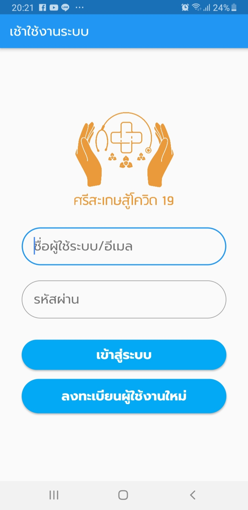
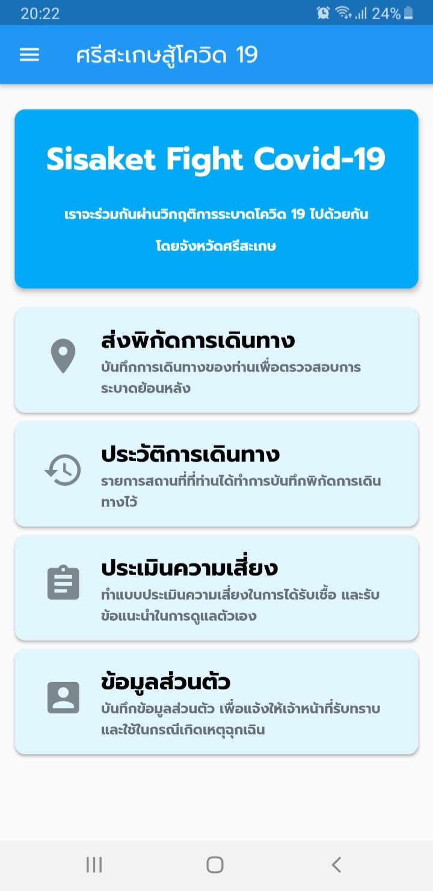
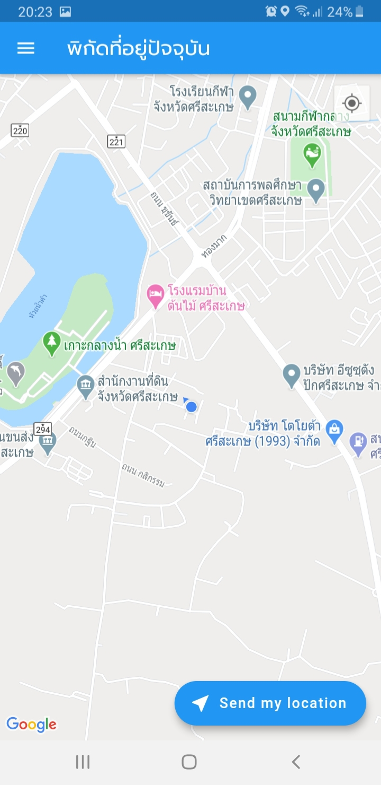
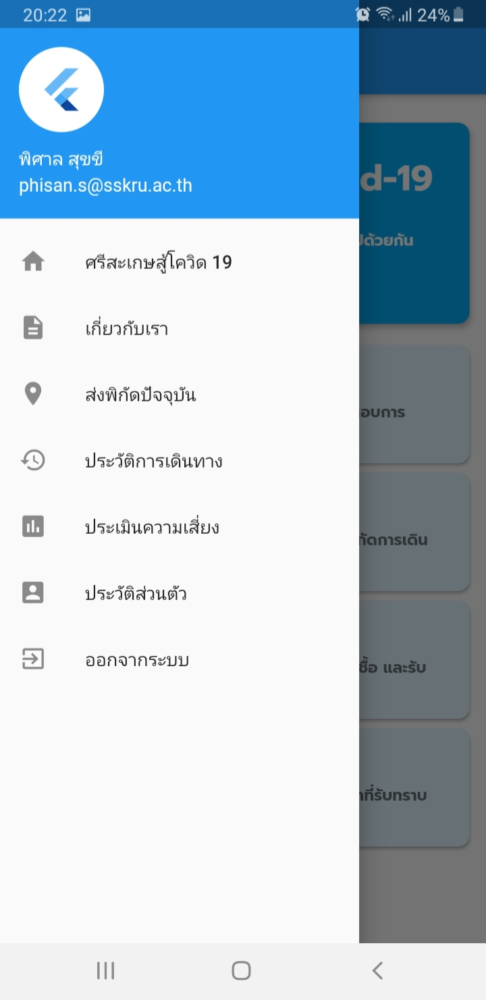
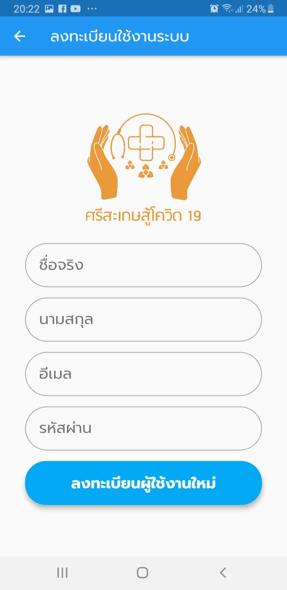
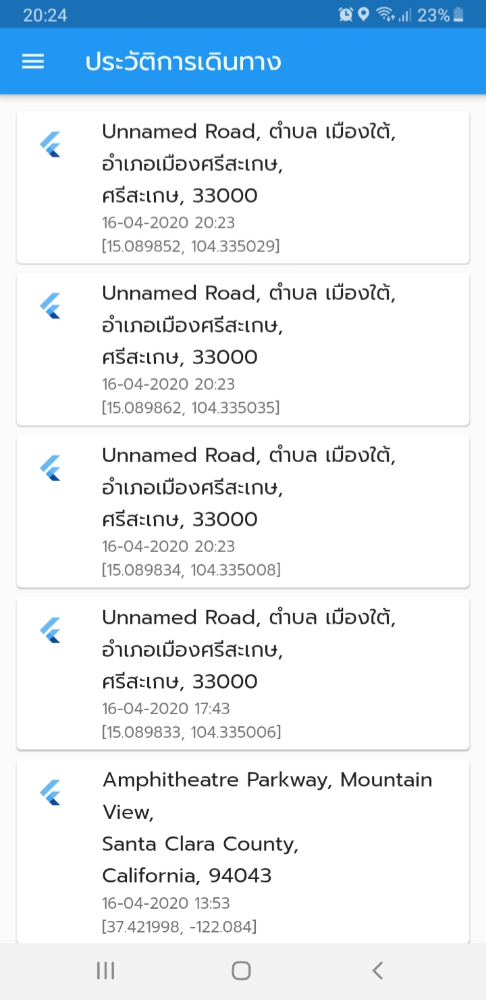

# sskcovid19

SSK Fight Covid 19

พัฒนาโดย 

อ.พิศาล สุขขี

สาขาวิชาวิทยาการคอมพิวเตอร์

มหาวิทยาลัยราชภัฏศรีสะเกษ

สำหรับโปรเจคนี้ ผู้พัฒนาได้พัฒนาขึ้นมาอย่างเร่งด้วย โดยเป็นการทำงานร่วมกันระหว่าง Mobile Application และ Web Application ที่สื่อสารกันผ่าน RESTful Web Services โดยมีแนวคิดในการพัฒนาโปรแกรมส่วนของ Mobile Application ให้มีความสามารถดังต่อไปนี้

1. สามารถลงทะเบียนสมัครเข้าใช้ระบบผ่านโปรแกรมมือถือ
2. สามารถล็อคอินเข้าใช้งานระบบ
3. รายงานพิกัดสถานที่ที่ตนเองเดินทางเข้าไปเป็นเป็นประวัติการเดินทางของตนเอง
4. สามารถแก้ไข/บันทึก ประวัติส่วนตัวที่จำเป็น เพื่อให้เจ้าหน้าที่รัฐสามารถติดต่อ หรือนำไปใช้เป็นข้อมูลพื้นฐานได้ในกรณีเกิดเหตุติดเชื้อ
5. สามารถเรียกดูประวัติการเดินทางรายบุคคลได้
6. การส่งพิกัดต่าง ๆ จะกระทำโดยสมัครใจ ไม่มีการแอบดึงพิกัดที่อยู่ หรือข้อมูลส่วนตัวอื่น ๆ

โปรแกรมในส่วนของ Mobile Application ผู้พัฒนาเลือกใช้ Flutter สำหรับการเขียน Mobile Application

ความสามารถในส่วนของ Mobile Application นี้จะหน้าเป็น Front-end ที่จะคอยดึงมูลจาก Web Application ผ่าน API และนำมาแสดงผลผ่านหน้าจอมือถือ

หรือมีการประมวลผลข้อมูลต่าง ๆ ในส่วนของ Mobile Application เช่น การแก้ไขข้อมูลประวัติสมาชิก หรือ การส่งพิกัดที่อยู่ปัจจุบันของสมาชิก นั้น Mobile Application จะทำการประมวลผล และส่งข้อมูลผ่าน API เพื่อให้ Web Application ทำการบันทึกต่อไป

# SSKCovid19 (Sisaket Fight Covid-19)

นโยบายความเป็นส่วนตัว

"ผู้พัฒนา" และ "ผู้ดูแลระบบ" ให้ความสำคัญกับการเก็บรักษาข้อมูลส่วนบุคคลของผู้ใช้บริการ โดยยึดมั่นในหลักการ การใช้ให้น้อยที่สุด ข้อมูลส่วนบุคคลของผู้ใช้บริการจะถูกเปิดใช้ในกรณีที่มีเหตุจำเป็นเท่านั้น ผู้พัฒนาจะไม่เปิดเผยเหรือนำไปใช้ ซึ่งข้อมูลส่วนบุคคลของผู้ใช้บริการ ก่อนได้รับความยินยอมจากผู้ใช้บริการ โดยข้อมูลใน "ศรีสะเกษสู้โควิด 19" จะถูกนำไปใช้เพื่อประกอบการการสืบค้นต้นหาตอการระบาดของเชื้อโควิด 19 และเพื่อแจ้งเตือนให้แก่ผู้ใช้บริการท่านอื่น ๆ ในะบบ

"ผู้พัฒนา" และ "ผู้ดูแลระบบ" รับรองว่าข้อมูลที่จัดเก็บทั้งหมดจะถูกจัดเก็บอย่างปลอดภัย เราปกป้อง และป้องกันข้อมูลส่วนตัวของผู้ใช้บริการโดย 

1. จำกัดการเข้าถึงข้อมูลส่วนตัว

2. จัดให้มีวิธีการทางเทคโนโลยีเพื่อป้องกันไม่ให้มีการเข้าสู่ระบบคอมพิวเตอร์ที่ไม่ได้รับอนุญาต ตลอดจนการเข้ารหัสข้อมูล

3. หากผู้ใช้บริการพบปัญหา หรือ ช่องโหว่ด้านความปลอดภัย ตลอดจนเหตุให้เชื่อว่าความเป็นส่วนตัวได้ถูกละเมิด กรุณาติดต่อ “ดูแลระบบ” เพื่อทำการตรวจสอบและแก้ไขปัญหาดังกล่าว

|หน้าจอล็อกอิน                            |หน้าทำงานหลัก                            |หน้าจอส่งพิกัด                            |
|--------------------------------------|--------------------------------------|--------------------------------------|
|  |  |  |
|ส่งข้อมูลไปยังเว็บแอพพลิเคชั่น                 |รายงานผลการส่งข้อมูล                       |รายงานบันทึกการเดินทาง                     |
|  |  |  |
